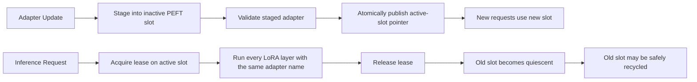

# Secure Atomic LoRA Updates for Live LLM Inference

A research-oriented implementation and evaluation of **secure, request-consistent, atomic LoRA adapter updates** for live language-model inference.

The project studies a failure mode that can occur when LoRA weights are replaced in place while inference requests are running: a single request may observe part of one adapter version and part of another, producing an **undeployed hybrid state**. The notebook demonstrates the race deterministically, evaluates multiple synchronization strategies, and implements a **double-buffered PEFT router with per-request leases** so each request remains on one committed adapter version while updates continue without globally blocking inference.

The notebook also includes a signed adapter-package admission pipeline with integrity, authenticity, schema, deployment-binding, version, expiry, rollback/replay, and crash-recovery checks.

## Main Notebook

- `secure_atomic_lora_Final_Paper.ipynb`

Running the notebook writes two Python modules dynamically:

- `secure_atomic_lora_colab.py` — secure package admission, custom versioned LoRA runtime, attack tests, request pinning, torn-update reproduction, and latency benchmarks.
- `paper_grade_peft_eval.py` — real Hugging Face PEFT experiments, double-buffered routing, baselines, stress tests, generation benchmarks, memory/update measurements, `torch.compile` checks, and optional vLLM evaluation.

## Research Problem

A conventional in-place LoRA hot swap can update the low-rank matrices independently:

```text
Request starts on version 1
        |
        |-- reads A_v1
        |
Updater replaces A -> A_v2
Updater replaces B -> B_v2
        |
        |-- request resumes and reads B_v2
        v
Result = hybrid(A_v1, B_v2)
```

That hybrid state is neither the committed old adapter nor the committed new adapter.

The project evaluates mechanisms that guarantee **single-version request consistency** during online updates.

## Proposed Atomic Update Design

The real-PEFT implementation uses two resident adapter slots and a request lease/pinning mechanism.



The central invariant implemented by `DoubleBufferedPeftRouter` is:

> The updater mutates only a slot with zero leases; each request names its pinned slot at every PEFT layer; publication changes only the active-slot pointer.

This allows an in-flight request to complete on the old version while requests beginning after publication use the new version.

## Secure Adapter Package Design

The custom secure-update path creates a package containing:

```text
adapter.safetensors
manifest.json
signature.hex
```

The manifest binds an update to its expected deployment and model and records information such as:

- schema version
- deployment ID
- base-model ID and base-model SHA-256 hash
- adapter ID and monotonically increasing adapter version
- parent manifest hash
- creation and expiration time
- signing-key ID
- LoRA rank and alpha
- target modules
- tensor names, shapes, dtypes, byte lengths, and hashes
- complete Safetensors package hash

The implementation uses **Ed25519 signatures** for authenticity and **SHA-256** for package/model/tensor integrity checks. An online witness/head mechanism is used to track committed versions and manifest ancestry.

## Security and Fault Tests

The included secure-package experiment exercises 24 cases, including the valid package and negative/recovery scenarios such as:

- forged signatures
- modified Safetensors bytes
- missing or unauthorized tensors
- dtype substitution
- shape substitution
- mix-and-match package content after signing
- embedded tensor-name mismatch
- wrong deployment
- wrong base model
- wrong signing key ID
- skipped versions
- stale-version replay
- future-dated or expired manifests
- invalid LoRA alpha
- oversized rank
- invalid declared byte length
- symlinked payloads
- crash before commit
- recovery after commit
- post-activation corruption detection

In the recorded notebook run, **all test cases passed their expected admission/rejection behavior**.

## Evaluation Suite

The notebook evaluates the following strategies:

| Strategy | Single-version request guarantee | Blocks inference during update | Keeps two adapter versions resident |
|---|---:|---:|---:|
| PEFT in-place hotswap without coordination | No | No | No |
| Full-model mutex | Yes | Yes | No |
| PEFT per-request `adapter_names` | Yes | No | Yes |
| Double-buffered PEFT slots with request leases | Yes | No | Yes |
| Custom immutable runtime pointer pinning | Yes | No | Yes |

The experiments include:

1. Deterministic custom-runtime torn-update reproduction.
2. Deterministic real-PEFT intra-layer A/B race.
3. Existing PEFT per-request adapter-name baseline.
4. Full-model mutex baseline.
5. Double-buffered PEFT update and quiescent slot reuse.
6. Request-pinning and routing overhead benchmarks.
7. Autoregressive generation latency/throughput measurements.
8. Natural concurrent hotswap stress testing.
9. Update-time and memory-cost measurements.
10. `torch.compile` correctness/recompilation indicators around hot swap.
11. Optional larger-model scale matrix.
12. Optional vLLM per-request LoRA baseline.

## Recorded Results from the Included Run

These numbers are **example measurements from the saved notebook execution**, not universal performance claims.

### Environment

| Item | Recorded value |
|---|---|
| Model | `sshleifer/tiny-gpt2` |
| Device | CUDA |
| GPU | Tesla T4 |
| PyTorch | `2.11.0+cu128` |
| Transformers | `5.13.1` |
| PEFT | `0.19.1` |
| Accelerate | `1.14.0` |
| Safetensors | `0.8.0` |

### Correctness and Safety

- The custom deterministic race produced `hybrid_A1_B2` for unsafe in-place updating.
- Request pointer pinning kept the protected request on `v1`.
- The real-PEFT deterministic race also reproduced `hybrid_A1_B2` during an uncoordinated hotswap.
- PEFT per-request `adapter_names` kept the request on `v1` even after the global adapter changed to `v2`.
- The full-model mutex kept the request on one version, but blocked the update/inference path.
- The double-buffered PEFT router kept the in-flight request on `v1`, published `v2` for new requests, and prevented recycling the old slot until its lease was released.

### Custom Runtime Request-Pinning Overhead

| Metric | Ordinary active LoRA | Protected request pin |
|---|---:|---:|
| Median forward latency | 3.038434 ms | 3.038471 ms |
| P95 forward latency | 3.694441 ms | 3.371744 ms |

Recorded median request-pinning overhead: approximately **0.0012%**, with a bootstrap 95% interval spanning zero in this run.

### PEFT Double-Buffer Router Overhead

| Metric | `adapter_names` only | Double-buffer router |
|---|---:|---:|
| Median latency | 12.6835 ms | 13.2471 ms |
| P95 latency | 24.7604 ms | 23.4452 ms |

Recorded median router overhead: approximately **4.44%**. The bootstrap interval was wide (`-17.41%` to `25.99%`), so this small debug-model benchmark should not be treated as a precise production estimate.

### Generation Benchmark

| Mode | Median TTFT | Median total latency | Median end-to-end tokens/s |
|---|---:|---:|---:|
| Active adapter | 3.802 ms | 56.934 ms | 210.82 |
| Per-request `adapter_names` | 4.587 ms | 66.877 ms | 179.52 |

### Natural Concurrent Stress Test

Configuration:

- 40 inference requests
- 24 adapter updates
- 4 request workers

Recorded outcome:

- 26 requests classified as `v1`
- 13 requests classified as `v2`
- 1 request classified as `hybrid_A1_B2`
- 0 request errors
- 0 update errors

The natural stress test estimates observed frequency only. **Absence of a hybrid in a finite stress run would not prove safety**; the deterministic race is used to show that the unsafe state is reachable.

### `torch.compile`

For the recorded T4 run using the `inductor` backend:

- result before swap matched `v1`
- result after swap matched `v2`
- the recorded Dynamo statistics reported one unique graph before and after the swap

The notebook explicitly compares compile counters rather than using timing alone as evidence about recompilation.

## Recommended Model Matrix

The notebook includes the following suggested evaluation tiers:

| Tier | Model | Target modules | Suggested ranks | Purpose |
|---|---|---|---|---|
| Debug | `sshleifer/tiny-gpt2` | `c_attn` | 4 | Fast correctness smoke test |
| Small | `Qwen/Qwen2.5-0.5B-Instruct` | `q_proj,v_proj` | 4, 16, 64 | Modern small-model evaluation |
| Medium | `TinyLlama/TinyLlama-1.1B-Chat-v1.0` | `q_proj,v_proj` | 4, 16, 64 | 1B-class serving evaluation |
| Large | `Qwen/Qwen2.5-3B-Instruct` | `q_proj,v_proj` | 4, 16, 64 | Larger GPU/concurrency evaluation |
| Optional 7B | `Qwen/Qwen2.5-7B-Instruct` | `q_proj,v_proj` | 4, 16, 64 | Systems-scale evaluation when hardware permits |

`RUN_SCALE_MATRIX` is disabled by default so the notebook remains practical for a normal Colab run.

## Installation

The notebook installs the core dependencies directly:

```bash
pip install \
  "transformers>=4.45,<6" \
  "peft>=0.14,<1" \
  "accelerate>=0.30" \
  "safetensors>=0.4" \
  "cryptography>=42" \
  "pandas>=2" \
  "psutil>=5"
```

The notebook also removes `torchao` in the tested Colab environment to avoid compatibility issues:

```bash
pip uninstall -y torchao
```

PyTorch is expected to be provided by the execution environment. A CUDA runtime is recommended for the paper-grade performance experiments.

## Quick Start

### Google Colab

1. Upload or open `secure_atomic_lora_Final_Paper.ipynb` in Google Colab.
2. Select a GPU runtime if performance measurements are required.
3. Optionally set an `HF_TOKEN` to avoid anonymous Hugging Face Hub rate limits.
4. Run the notebook from top to bottom.
5. Inspect the generated CSV/JSON experiment artifacts under:

```text
/content/secure_atomic_lora_results/
```

6. The final notebook cell creates:

```text
/content/secure_atomic_lora_results.zip
```

### Local Jupyter Environment

The notebook uses Colab-style absolute paths such as `/content/...`. To run locally, change the output paths to a writable local directory before executing the experiment cells.

## Main Configuration

The real-PEFT evaluation is controlled through `PaperEvalConfig`.

```python
PAPER_CONFIG = peft_eval.PaperEvalConfig(
    model_id="sshleifer/tiny-gpt2",
    revision=None,
    target_modules=("c_attn",),
    rank=4,
    alpha=8.0,
    dtype="float32",
    stress_requests=40,
    stress_updates=24,
    stress_workers=4,
    benchmark_trials=30,
    benchmark_warmups=5,
    max_new_tokens=12,
    compile_backend="inductor",
    match_atol=1e-5,
    match_rtol=1e-4,
    require_reference_separation=True,
)
```

For archival or paper reproduction, replace `revision=None` with an **exact Hugging Face model commit hash** so the base model is immutable and reproducible.

## Generated Results

The secure-runtime section writes files such as:

```text
secure_atomic_lora_results/
├── attack_results.csv
├── concurrency_results.csv
├── torn_update_results.csv
├── torn_update_summary.json
├── pinning_overhead_trials.csv
├── pinning_overhead_summary.json
├── latency_trials.csv
├── latency_summary.json
└── experiment_summary.json
```

The PEFT evaluation writes a larger results tree containing artifacts such as:

```text
secure_atomic_lora_results/paper_grade_peft/
├── environment.json
├── config.json
├── recommended_model_matrix.csv
├── strategy_safety_comparison.csv
├── paper_grade_summary.json
├── real_peft_race/
├── named_adapter_pin/
├── full_model_mutex/
├── double_buffered_peft/
├── double_buffer_overhead/
├── named_adapter_overhead/
├── generation/
├── natural_stress/
├── update_memory/
└── torch_compile/
```

Individual folders contain CSV trial data and JSON summaries to support plotting, statistical analysis, and paper tables.

## Optional vLLM Baseline

The notebook contains an optional vLLM server benchmark. It is disabled by default:

```python
RUN_VLLM_BASELINE = False
```

To use it:

1. Use a model supported by vLLM rather than `sshleifer/tiny-gpt2`.
2. Install/configure vLLM in the runtime.
3. Build the PEFT artifacts for the selected model.
4. Set `RUN_VLLM_BASELINE = True`.

The benchmark starts a vLLM server with two LoRA adapters and measures per-request LoRA behavior.

## Reproducibility Notes

For publication-quality runs:

- pin the base-model `revision` to an exact commit hash;
- record package versions and CUDA/GPU information from `environment.json`;
- keep the random seed fixed (`20260722` in the provided implementation);
- run enough warmups and benchmark trials for the target hardware;
- report confidence intervals rather than only point estimates;
- evaluate modern architectures and multiple LoRA ranks;
- retain raw CSV files in addition to summarized tables;
- distinguish deterministic reachability experiments from probabilistic stress observations.

## Important Limitations

- `sshleifer/tiny-gpt2` is used primarily as a fast correctness/debug model; its timing and memory numbers should not be generalized to production LLMs.
- Double buffering deliberately keeps two adapter versions resident, trading a small amount of additional adapter memory for non-blocking request consistency.
- The notebook demonstrates an experimental systems design; production deployment should include operational hardening, persistent witness storage, key-management integration, monitoring, and failure-injection testing appropriate to the serving environment.
- Natural concurrency stress testing cannot by itself prove the absence of races.
- Hardware, CUDA, PyTorch, Transformers, and PEFT versions can materially change benchmark results.

## Prior-Art Note Included in the Evaluation

The notebook records a distinction from Hugging Face PEFT issue #804: that issue discusses inter-layer active-adapter switching, while this notebook's deterministic PEFT experiment focuses on **intra-layer LoRA A/B tearing during in-place weight replacement**.

Reference: <https://github.com/huggingface/peft/issues/804>

## Suggested Citation

If this repository accompanies a paper or thesis, replace the placeholder below with the final publication metadata:

```bibtex
@misc{secure_atomic_lora,
  title  = {Secure Atomic LoRA Updates for Live LLM Inference},
  author = {Author Name},
  year   = {2026},
  note   = {Research implementation and evaluation notebook}
}
```

## Acknowledgements

This implementation builds on the PyTorch, Hugging Face Transformers, PEFT, Safetensors, Accelerate, and Cryptography ecosystems.
